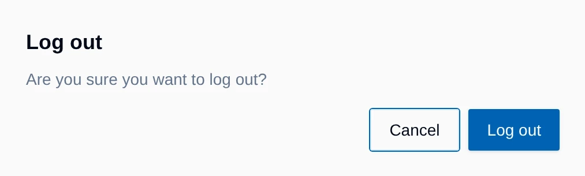

<picture>
  <source media="(prefers-color-scheme: dark)" srcset="public/Logo_Dark_Mode.svg"/>
  <source media="(prefers-color-scheme: light)" srcset="public/Logo_Light_Mode.svg"/>
  
</picture>

# PROMEDIA SPACE

**Version 1.1.5**

*An internal web tool for monitoring warehouse utilization, staging capacity, inbound and outbound logistics, and a Control Center for final inspections*

*Built by [Engin Sarak](https://github.com/EnginSarak)*

---

## Table of Contents

- [Overview](#overview)
- [Install it as an app](#install-it-as-an-app)
- [Getting Started](#getting-started)
- [Features](#features)
  - [Dashboard](#dashboard)
  - [Pallet Staging Capacity](#pallet-staging-capacity)
  - [Floor Plan](#floor-plan)
  - [Forecast](#forecast)
  - [Outbound](#outbound)
  - [Priorities](#priorities)
  - [Problem Flags](#problem-flags)
  - [Task List](#task-list)
  - [Inbound and Bin Usage](#inbound-and-bin-usage)
  - [Maintenance Panel](#maintenance-panel)
  - [Control Center](#control-center)
  - [Issues Center](#issues-center)
  - [Monitor Mode](#monitor-mode)
  - [Warehouse Operator](#warehouse-operator)
  - [On the Phone](#on-the-phone)
  - [Theming](#theming)
- [Keyboard Shortcuts](#keyboard-shortcuts)
- [Access Control](#access-control)
- [FAQ](#faq)
- [Changelog](#changelog)

---

## Overview

PROMEDIA SPACE is a closed-source, access-controlled internal web application built for Promedia's logistics operations. It shows how full the pallet staging area is right now. Every staging slot in the warehouse is a slot on screen, so anyone can see at a glance which orders are standing there, what still has to be picked and which deliveries are on their way.

Everyone looks at the same picture. When an order is marked as picked or a delivery is logged, every open screen shows it within seconds. That replaces a lot of calls and emails asking "Is this ready yet?" or "Do we still have room for that?".

With PROMEDIA SPACE the team can:

- see the staging area live as a 3D model, together with every outbound order and inbound delivery
- preview any future day with Forecast
- create and edit orders, tick off the warehouse steps, set pickup dates and delete rows
- assign priorities and flag orders as problems
- work through tasks with checklists in the Task List
- log deliveries and mark them as stored
- manage capacity, bin counts and access tokens
- check goods against the delivery note in the Control Center
- keep unresolved cases with photos in the Issues Center
- run a board on the TV screen in the warehouse with Monitor Mode

What each person sees depends on their role, see [Access Control](#access-control).

---

## Preview

  

---

## Install it as an app

PROMEDIA SPACE runs in the browser, but it can also be installed as a standalone app on any device.

| Device | How |
|---|---|
| **iPhone / iPad** | Open the site in Safari, tap **Share**, then **Add to Home Screen** |
| **Android** | Open it in Chrome, tap the **⋮** menu, then **Install app**. Chrome often offers this by itself |
| **Windows / macOS** | In Chrome or Edge, click the install icon at the right-hand end of the address bar. In Edge it also sits under **⋯ → Apps → Install this site as an app** |

---

## Getting Started

PROMEDIA SPACE runs in Chrome, Edge or Safari. Nothing has to be installed on a PC.

1. Open PROMEDIA SPACE in the browser.
2. Enter your personal token in the **Access Token** field.
3. Click **Enter** or press the Enter key.

The browser remembers the token, so the next visit opens the dashboard straight away. A wrong token makes the field shake briefly and shows "Invalid token. Please try again."

  
  

**Logout** in the top right corner asks once more before it signs you out. That matters on shared computers. On your own PC, closing the tab is enough.

> [!IMPORTANT]
> The token is your key to the app. Don't forward it and don't paste it into emails or shared documents. If you think someone else knows it, generate a new one in the [Users](#users) tab and delete the old one.

---

## Features

### Dashboard

This is the screen you land on after login. It keeps itself up to date and never needs a reload.

  

| # | Element | # | Element |
|---|---|---|---|
| **1** | Theme: system, light or dark | **6** | Logout |
| **2** | Tasks: the Task List with open tasks | **7** | Pallet Staging Capacity: how full the floor is |
| **3** | Control Center: check goods against the delivery note | **8** | Floor Plan: the 3D model of the staging area |
| **4** | Issues Center: open cases | **9** | Switch to 2D, and Forecast |
| **5** | Maintenance: orders, deliveries, settings | **10** | Outbound: every active order with its status |

Further down the page sit the **Inbound** and **Bin Usage** lists. On a laptop you may have to scroll for them.

The time after **Updated** in the capacity card shows when the data last changed. If it says a few minutes ago, nothing has happened since.

---

### Pallet Staging Capacity

The bar at the top answers the most common question: how much room is left?

  

The big number counts the pallets that are really standing on the floor, out of all staging slots. In the example, 66 of 140 are taken.

| Segment | Meaning |
|---|---|
| **picked** | Picked outbound orders standing on the floor |
| **inbound** | Arrived deliveries waiting to be stored |
| **pending pick** | Orders that are logged but not picked yet. They will need space soon |
| **expected inbound** | Deliveries due tomorrow |
| **free** | Slots nobody has claimed |

The two small markers above the bar show percentages. The first one is what stands on the floor right now. The second one pulses gently and shows where the floor ends up once everything open has been picked or has arrived. If that total goes over the capacity, a warning below the bar names the number of missing slots.

The capacity itself is set in the [Config](#config) tab.

---

### Floor Plan

On a computer the Floor Plan opens as a 3D model of the staging area. This is the everyday view. Every box you see is a pallet on the floor.

  

| What you see | Meaning |
|---|---|
| Color of a pallet | The shipment. All pallets leaving on the same truck share a color and stand next to each other |
| Flag on the pallet | The destination country |
| Solid pallet | Picked. The pallet is standing on the floor |
| See-through pallet that slowly pulses | Not there yet: an order that still has to be picked, or a delivery expected tomorrow. The slot is already reserved |
| Pallet with a white INBOUND sign | An arrived delivery waiting to be stored |
| Grey pad on the floor | Free slot |

What is already standing never gets pushed off the floor. Picked orders and arrived deliveries keep their slots until they are picked up or stored, and they always appear with all of their pallets. Pending picks and expected deliveries fill the free slots in order and are the first to go when space runs out.

**Moving around**

  
  

- **Rotate:** hold the left mouse button and drag.
- **Zoom:** use the mouse wheel or the slider with the magnifiers in the small control pad on the right.
- The **arrow buttons** on the pad rotate the view step by step. The blue button in the middle starts or stops the slow auto-rotation, and so does `P`.

**Hovering a pallet** brings up a card next to it with the order data: customer, date, pick number, SORD number, country, pickup date, delivery date, forwarder, colli and status.

  

**Clicking a pallet** opens the full order card with notes. Click any value to copy it, for example the SORD number for an email. The X or `Esc` closes the card.

The color of the pickup date means something: green is confirmed, orange is an estimate, red means ASAP or already overdue. **N/A** means there is no pickup date yet. Hovering a row in the Outbound list lights up that order on the floor as well.

  

**The 2D view**

The **2D** button shows the same floor as a flat grid with one tile per slot. The button then reads **3D** and takes you back. PROMEDIA SPACE remembers which one you used last.

In 2D the fill color of a tile is the country and the thick border is the shipment. The label is a short code for the customer plus a running number, so `CA · 3` is the third pallet of Customer A. Striped tiles are pending picks. The small marks in the corner show progress: `✓` Controlled, `✓✓` Ordered, `★` Confirmed.

  

---

### Forecast

Forecast shows how the floor will probably look on a future day, in 3D and in 2D. It is the quickest way to check whether a new order still fits.

1. Click **Forecast** in the Floor Plan.
2. Pick a day in the calendar. The **CW** column shows the calendar week, and public holidays in NRW are red.
3. Floor, bar and numbers now show that day.
4. The small arrows next to the date move one day forward or back.
5. **Back to Live** returns to today.

The arrow to the right of **Forecast** jumps straight to tomorrow. On a public holiday a red line with the holiday's name appears under the banner.

  

  

The calculation is simple. An order stays on the floor up to and including its pickup day and is gone the day after. A delivery shows up on its arrival day and counts as stored the day after.

  

Orders picked up by then are missing, the bar shows the projected numbers, and the yellow banner is a reminder that this is a projection.

---

### Outbound

The Outbound card on the right lists every active order. The most urgent ones are at the top.

  

Each row shows the customer, a value that switches every few seconds between pickup date and pallet count, and a status badge. The order is: priority first, then ASAP orders, then by pickup date.

Maintainers see two extra marks after the customer name. A **red circle with a check** means the pick list has been printed. A **yellow warning triangle** means there is an open task for this order in the [Task List](#task-list). Hover it to see the task's title. A row that pulses yellow belongs to an order whose pick list hasn't been printed yet although the pickup is coming up.

| Badge | Meaning |
|---|---|
| **Pending Pick** | Logged, not picked yet |
| **Picked** | Picked, standing on the floor |
| **Controlled** | Checked by the warehouse |
| **Ordered** | Forwarder booked |
| **Confirmed** | Pickup confirmed by the forwarder |

Two more marks are possible. An order with a priority shows a dark **P1**, **P2** and so on right next to its status, see [Priorities](#priorities). A red **PROBLEM** means the order has been flagged as a problem, see [Problem Flags](#problem-flags).

**Shipments with several orders**

Orders for the same customer with the same forwarder and the same delivery date travel on one truck, up to 33 pallets. PROMEDIA SPACE groups them automatically: they share one color on the floor and appear as a single row in the Outbound list with the total pallet count.

Clicking such a row opens the **Groupage** table with every order of the shipment and its own status. Clicking a row there opens that single order.

  

**The full lists**

The two small icons in the header of the Outbound card open larger views. The arrow icon (or `E`) shows all orders with country, pickup, delivery date, colli and status. The table icon (or `T`) opens the **Outbound Overview** with every column. From there everything can be exported as CSV, and **History** shows the orders picked up in the last 365 days.

  

The colored line on the left connects the orders of one shipment.

---

### Priorities

When something simply has to go first, it gets a priority.

  

1. Right-click the order in the Outbound list. On a phone or tablet, hold the row for half a second.
2. Choose a priority number. Only free numbers are offered.
3. Confirm with **Confirm**.

> [!NOTE]
> A priority can't be changed until the order is set to Ordered. As soon as **Ordered** is ticked, PROMEDIA SPACE removes the priority by itself.

Every priority appears as a dark badge next to the status: **P1**, **P2**, **P3** and so on. All orders of a groupage share the same priority. On a phone the badge reads **PRIORITY 1** and alternates with the status.

**How the numbers move up**

  
  

Once the order with **P1** is set to Ordered, its badge disappears and every other priority moves up by one: 2 becomes 1, 3 becomes 2, and so on. Nobody has to rearrange anything. The same happens when an order with a priority is picked up or deleted. A number only moves up once no order holds it anymore, so the same number never shows up twice.

---

### Problem Flags

When something is wrong with an order, a Maintainer flags it as a problem. Everyone then sees the red **PROBLEM** badge, and the order card shows the reason.

1. Right-click the order's **status badge** in the Outbound list, not its name. On a phone, hold the badge.
2. Choose **PROBLEM**.
3. Type the reason. Saving without one isn't possible.
4. Click **Mark as problem**.

  
  

The row turns grey and the badge reads PROBLEM. The order card shows a red box with the reason at the top.

Once the problem is solved, **Clear problem** in the same menu removes the flag right away, without asking. The flag has no effect on the pick order. It is only a signal to everyone.

  

---

### Task List

The Task List holds tasks with checklists, so nothing gets forgotten with customs, labeling or follow-up questions. Only Maintainers see it.

  
  

Click **Tasks** in the header. The red number on the button shows how many tasks are open. The **Task List** slides in from the right, and the X, a click next to it or `Esc` closes it again.

Every task is a card with:

- a badge, **EX1** for customs tasks and **General** for everything else, and the title
- customer, SORD number and country, if the task belongs to an order
- a progress bar of finished steps that turns green when everything is ticked
- the checklist itself
- **Mark done**, which moves the task to **Completed**, and **Delete**, which removes it without asking

Finished tasks wait at the bottom under **Completed**, where they can be reopened or deleted for good.

**Tasks PROMEDIA SPACE creates by itself**

Saving an order creates a task automatically in a few cases. For a new order to a country outside the EU, for example, PROMEDIA SPACE asks whether an export declaration is needed.

  

| Trigger | Task |
|---|---|
| New order to a country outside the EU | PROMEDIA SPACE asks "Export Declaration Required?". If the customs value or the gross weight is above 1,000 (€ or kg), **Yes, create checklist** creates an EX1 task with six steps. Otherwise **No, under threshold** |
| Destination Saudi Arabia | PROMEDIA SPACE asks about air freight with pumps on board. **Yes** creates a task for the UN 3481 and SAG-06 labeling |
| Destination Brazil | An ISPM 15 task: IPPC marking on every wooden pallet and a confirmation by email |
| Certain customers | Customer-specific reminders, such as letting the customer's operations team know or booking a delivery slot at the receiving warehouse |

A task that was deleted does not come back the next time the order is saved.

**Creating a task**

1. Click **Add Task** in the Task List.
2. Choose the type: **General** or **EX1**. EX1 comes with the six customs steps filled in.
3. Enter a title under **Task**. If you leave it empty, PROMEDIA SPACE picks a fitting one.
4. Under **Link to order**, the task can be attached to an order (**Outbound**) or a delivery (**Inbound**). This is optional.
5. Add steps if needed, up to eight.
6. Click **Create**.

If the task is linked to an order, the yellow warning triangle shows up there until the task is done.

**Editing a checklist**

Click **Edit** next to **Checklist** on a card. Steps can then be renamed with the pencil, removed with the bin, added, and moved by holding a step briefly and dragging it to its new place. Every change is saved immediately. **Done** leaves edit mode.

---

### Inbound and Bin Usage

Both cards sit below the Floor Plan.

  

**Inbound** lists the deliveries we know about. **EXPECTED** with a date means it hasn't arrived yet. **ARRIVED** means it is in the building and takes up slots until it is stored. On the arrival day itself the badge reads **ARRIVED (about to arrive)**: nobody knows exactly when the truck turns up, so its pallets get their place on the floor from the morning on, even though they are probably still on the road. A click on a row shows the details.

**Marking a delivery as stored**

Once a delivery has been put away, right-click its row (hold it on a phone) and choose **Mark as Stored**. The delivery then disappears from the list and from the floor.

  

> [!WARNING]
> Mark as Stored happens immediately and without asking. The entry is removed, not archived.

  

**Bin Usage** shows how many storage bins are taken today, the monthly average and the days of the current week. A click on the heading opens an overview of the whole year. The numbers are entered in the [Config](#config) tab.

---

### Maintenance Panel

**Maintenance** in the header (or `M`) is where orders and deliveries are maintained. It is open to Maintainers and, with restrictions, to Customer Service.

  

The window has four tabs: **Outbound**, **Inbound**, **Config** and **Users**. The colored dots in the top right corner switch to fullscreen (green), back to a window (yellow) and close it (red). In fullscreen, **+** and **−** zoom the table between 50 and 100 percent.

#### Outbound orders

The Outbound tab has one row per order. Maintainers can edit every field, tick the checkboxes, set the pickup date and delete rows.

**Adding an order**

1. Click **Add Row** (or press `N`). An empty row appears at the bottom and the cursor jumps into **Customer**.
2. Fill in the fields as described below. While you type a country, PROMEDIA SPACE suggests matching ones.
3. As soon as the row has a customer and a delivery date, it saves itself after a second or two. The blue button then reads **Saving automatically...**.

  

  

| Field | What goes in |
|---|---|
| **Customer** | The customer's name. The first letter is capitalized automatically |
| **Date** | The day the order was announced. This is *not* the delivery date. A click on the cell opens the calendar |
| **Pick No.** | The pick list number, for example `WP00160`. Several numbers fit in one cell, and an `&` between them becomes a comma |
| **SORD No.** | The order number, for example `SORD26-00160` or `TRN-ORD-00123`. Same rules as Pick No. |
| **Country** | The two-letter code of the destination country, for example `IT`. Typing opens a list of suggestions |
| **Delivered by** | The date the customer wants the goods. Pick it in the calendar or set ASAP |
| **Forwarder** | The forwarder. Common misspellings of a forwarder's name correct themselves |
| **Colli** | A number plus `PAL` or `BOX`, for example `3 PAL` or `12 BOX`. Only PAL orders get slots on the floor. If PAL or BOX is missing, PROMEDIA SPACE points it out |
| **Notes** | Anything the warehouse should know |

**The checkboxes**

The columns **Printed**, **Picked**, **Control**, **Ordered**, **Confirmed** and **Picked Up** follow the path of an order. Every tick is saved right away and the row flashes green for a moment.

| Checkbox | What happens |
|---|---|
| **Printed** | The pick list is printed. The red check appears in the Outbound list |
| **Picked** | The order is picked and standing on the floor. If Colli holds a PAL count, PROMEDIA SPACE first asks for the number of pallets |
| **Control** | The goods have been checked. The [Control Center](#control-center) can also set this automatically |
| **Ordered** | The forwarder is booked. A priority is dropped at this point |
| **Confirmed** | The pickup is confirmed. If there is no pickup date yet, or it is set to ASAP, PROMEDIA SPACE asks for the date |
| **Picked Up** | The goods have left. The row moves to History at once, without asking |

  
  

On **Picked**, the warehouse's pallet count gets a second look and can be corrected. **Confirm** writes it into Colli as "N PAL". On **Confirmed** without a pickup date, the date the forwarder named goes in here.

**The pickup date**

PROMEDIA SPACE suggests the pickup date by itself, based on country, order date and delivery date. A small blue dot in the corner means the date still follows that suggestion and changes along with it when the country or the delivery date changes.

  

A click on the **Pickup Date** cell lets you choose a date yourself. The blue dot then disappears and PROMEDIA SPACE leaves your date alone. **ASAP** sets the pickup to as soon as possible, **Clear date** empties the field.

The colors: green is confirmed, orange is an estimate, red is ASAP or overdue. Once an order is confirmed, PROMEDIA SPACE stops changing its date by itself. It can still be adjusted by hand.

**ASAP orders**

If the customer wants the goods as fast as possible, right-click **Delivered by** (hold it on a tablet) and choose **Set ASAP**. The cell shows a red ASAP, and the pickup becomes ASAP as well as long as the order isn't confirmed. **Remove ASAP** in the same menu takes it back.

  

**Saving, undo and delete**

PROMEDIA SPACE saves by itself as soon as a row has a **Customer** and a **Delivered by** date (or a pickup). Incomplete rows wait, so half-typed orders don't land on the dashboard. **Save Changes** saves them anyway. Closing the window with unsaved changes asks first.

The bin at the end of a row deletes the order without asking. **Undo** reverts your last steps, up to ten, including a delete.

**Splitting and linking shipments**

Orders go on one truck automatically when customer, forwarder and delivery date match. Sometimes that isn't wanted. A right-click on an order's customer name changes it:

  

- **Detach from group** takes the order out of its shipment. It then travels on its own.
- **Reattach to group** brings a detached order back.
- **Link with order...** connects the order to another one by hand. Search by customer or SORD number. PROMEDIA SPACE shows how many pallets are still free on the truck.
- **Remove manual link** undoes a manual link.

The colored line on the left of the table shows which rows belong to the same shipment.

**History**

After **Picked Up**, an order moves to History. **History** shows everything picked up in the last 365 days. After that, PROMEDIA SPACE deletes the entries by itself.

  

- PROMEDIA SPACE sets the date in the **Picked Up** column to the day of the tick, shown in orange. Click it and choose the right date: it turns green and counts as confirmed.
- The blue arrow brings an order back into the table, for example when Picked Up was ticked by mistake.
- The red bin deletes the entry without asking.

**Back** returns to the table.

  

**Customer Service** works in the same table with restrictions. It can add rows, edit every text field and assign priorities. The checkboxes are greyed out, the pickup date is visible but can't be edited, rows can't be deleted, and History is read-only.

#### Inbound deliveries

The **Inbound** tab is where upcoming deliveries are logged, so their pallets get a place on the floor.

  

1. Enter the supplier or a reference in **Supplier / Ref.**
2. Enter the number of pallets under **PAL**.
3. Choose the **Expected Date**. Today is filled in.
4. Click **Add**.

The delivery shows up in the list and on the dashboard. With today's date or an earlier one it counts as **ARRIVED**, with a later one as **PENDING**.

The pencil changes supplier, pallets or date. The check saves, the X cancels. The red X deletes the entry.

> [!WARNING]
> Deleting happens immediately, without asking. Better look twice before clicking the red X.

A delivery that has been put away is marked with [Mark as Stored](#inbound-and-bin-usage) on the dashboard.

#### Config

Maintainers only.

  

Under **Warehouse Capacity** you set how many staging slots the floor has (**Pallet Staging Slots**) and how many bins there are in total (**Total Bins**). **Save** stores it, and the floor on the dashboard follows right away.

Under **Log Bin Usage** you enter how many bins are taken today: the number in **Used Bins**, then **Add Entry**. **Date** fills in a day that was missed. Future days aren't possible, and an existing entry for the same day is replaced.

The **Bin Usage History** table lists every entry with its percentage. The pencil corrects a number, the red X deletes the entry without asking.

#### Users

Maintainers only. PROMEDIA SPACE has no accounts with passwords. Every access is a token, and the token's role decides what someone sees.

  

1. Choose the role under **Role**: **Maintainer**, **Viewer**, **Customer Service** or **Warehouse Operator**.
2. Click **Generate Token**.
3. The new token is shown and copied to the clipboard automatically.
4. Hand it to the person through a safe channel.

The list below shows every token with its role and date. The copy icon puts a token back on the clipboard. The bin deletes it after a confirmation, and that person is locked out immediately. Your own token can't be deleted.

> [!TIP]
> If someone loses their token or leaves the team, generate a new token if needed and delete the old one.

---

### Control Center

The last check before goods leave the building: does the pallet match the delivery note, with article, batch and quantity? The batch number in particular is what a recall is traced by later.

Click **Control Center** in the header or press `C`. The Control Center works with two devices: the PC loads the delivery notes and the phone does the checking. Both use the same PROMEDIA SPACE token, so there is nothing to pair. A delivery note dropped in the office is on every phone in the warehouse seconds later.

**On the PC**

  

1. Export the delivery note from Business Central as XML.
2. Click **Add XML documents** and choose the file, or simply drag it into the window. Folders and anything that isn't XML are filtered out. PROMEDIA SPACE sends the notes to the phones.
3. With **Start scanning**, the PC forwards the scans. A counter shows how many were sent. If a scan doesn't arrive, PROMEDIA SPACE says so and you scan it again. **Finished scanning** ends it.

The top right corner shows whether a phone is connected right now. **Log** shows what was transferred in the last 14 days. **Back** returns to the dashboard.

**On the phone**

Open PROMEDIA SPACE on the phone and tap the Control Center icon. The start page lists the inspections: open ones at the top, finished ones below, sorted by day. A red dot means an inspection was filed incomplete.

  

**Running an inspection**

1. Tap the inspection to open it.
2. Choose the counting unit at the bottom: **Pallet**, **Layer**, **Carton** or **Single**. It applies to every following scan.
3. Scan the batch (lot) on the goods. PROMEDIA SPACE finds the matching line by its lot number, because that is the one value barcode and delivery note reliably share.
4. Enter the quantity in the count sheet. The fields do the math, so something like `12x8x3-1` works. A layer also takes single cartons on top, or missing ones plus loose pieces, so a broken pallet is booked in one step.
5. If a line goes over its target, PROMEDIA SPACE warns with "Over target". Booking is still possible.

With **Cashier mode**, every scan books one unit straight away without the count sheet. That is handy for lots of identical cartons. PROMEDIA SPACE learns the pack size per article and shares it with every device. Each booking gives a short tone and a flash at the edge of the screen, because whoever is counting is looking at the goods, not at the phone.

**Filing an inspection**

  

At the end PROMEDIA SPACE shows a summary: "All lines match exactly" when everything adds up, otherwise "Inspection incomplete" with the number of matching lines. Enter your name as the inspector and file the inspection.

When filing, PROMEDIA SPACE asks which orders in the Outbound table the inspection belongs to. Matching rows are already selected.

- A complete inspection sets **Printed**, **Picked** and **Control** on those orders.
- An incomplete one sets only **Printed** and **Picked**.

The inspection number then appears in the order card and in History. A click on it, or on the status badge, opens the **Final inspection** with article, batch, expiry date, counted and target quantity.

Next to the customer name, an ⓘ opens the shipment info from the delivery notes: number of packages with their unit, net and gross weight, every delivery note, destination and customer address. Destination and customer are kept apart, since the goods don't always go to the party that ordered them. Every value is copied with a click.

The three dots on a filed inspection assign it to rows in PROMEDIA SPACE afterwards (**Assign rows in SPACE**), change the inspector's name or remove it.

---

### Issues Center

All cases that are still unresolved: problems and complaints that have been open for a while or are at risk of being forgotten, so that someone acts on them.

  

Click **Issues Center** in the header or press `I`. Every case is a card with a photo, a title and the first lines of text. **Read more** opens the whole case with all photos, and a click on a photo opens it full screen with zoom.

Every role can read the cases. Only Maintainers can create, edit and delete them.

**Creating a case**

1. Click **New Case**.
2. Enter a **Title**: what is unresolved?
3. Describe the case under **Description**. Text can be bold, italic and underlined, in six colors.
4. Add photos under **Images**, up to 20. The star makes a photo the card's cover. Photos are compressed in the browser before upload, so a phone photo goes up in seconds.
5. Click **Publish**.

  
  

In an open case, **Edit** changes text and photos. The bin deletes the case after a confirmation, for everyone and with all photos. There is no "Done" button: a solved case gets deleted. After two years PROMEDIA SPACE removes old cases by itself.

---

### Monitor Mode

Monitor Mode turns PROMEDIA SPACE into a board for the TV screen in the warehouse hall. It belongs to the **Warehouse Operator** role and is available on screens at least 1024 pixels wide.

Click **Monitor** in the header. PROMEDIA SPACE switches to fullscreen and shows two boards that take turns.

  

The **outbound board** lists every open order in pick order, with customer, pick number, SORD number, country, pickup ETA, delivery date, forwarder, colli and status. Priorities appear as P badges at the end of the row. Orders of the same groupage stand together with a GROUPAGE label next to the customer name. They carry the same badge, and their badges are joined by a bridge, so it is clear from across the hall that they leave on one truck. Dates use two-digit years to keep the columns tidy.

  

The **inbound board** shows supplier, pallets and status: ARRIVED, or EXPECTED with its date.

Each board shows 14 rows per page. A board with a single page stays for 20 seconds. Longer lists turn the page every 10 seconds, with dots at the bottom showing where you are, and every page gets its time before the other board follows.

  

The header hides itself so the board has the whole screen, and so does the mouse pointer. Moving the mouse or touching the screen brings the header back for three seconds. **Monitor** in the header leaves Monitor Mode again, and `F5` toggles browser fullscreen without reloading the page.

PROMEDIA SPACE remembers Monitor Mode per token. A dedicated warehouse display is set up once and stays on the board after a reload or a restart.

---

### Warehouse Operator

The Warehouse Operator role is made for the people on the warehouse floor. Its dashboard is read-only, with a few actions that belong to the hall.

  

- **EN / DE** in the header switches the whole interface between English and German. This switch only exists for this role.
- **Monitor** starts [Monitor Mode](#monitor-mode).
- **Control Center** opens the inspection, see [Control Center](#control-center).
- **Issues Center** shows the open cases.

**Marking an order as picked up**

When the truck has left, right-click the order in the Outbound list (hold it on a phone or tablet) and choose **Mark as Picked Up**. The order, or every order of the groupage, moves to History and its slots on the floor are free again.

  

Arrived deliveries are marked with [Mark as Stored](#inbound-and-bin-usage) in the same way once they have been put away.

---

### On the Phone

PROMEDIA SPACE works on a phone too. Saved to the home screen, it opens like an app, full screen and without the Safari bar. How to install it is described in [Install it as an app](#install-it-as-an-app).

  

In Safari, PROMEDIA SPACE shows a hint at the bottom: "Tap Share, then Add to Home Screen". The X on the hint hides it for good.

On a phone the page is stacked: capacity at the top, then the Floor Plan, then Outbound, Inbound and Bin Usage. The Floor Plan opens in 3D here as well. Tap **2D** next to it for the flat grid and **3D** to go back. The phone remembers the choice. The header shows icons only: theme, Tasks, Control Center, Issues Center (megaphone) and Maintenance (gear). **Logout** sits at the very bottom of the page.

There is no mouse. Tap a pallet, a tile or a row to open the order card. Wherever the computer needs a right-click (priority, problem, ASAP, shipment menu, Mark as Stored, Mark as Picked Up), hold for half a second instead.

  

Rotate the 3D floor with one finger and zoom with two. Maintenance works too, the table scrolls sideways. For a lot of orders a computer is more comfortable. For a quick look in between and for the Control Center, the phone is ideal.

---

### Theming

The three small icons at the left of the header change the look: the monitor follows the computer's setting, the sun is light, the moon is dark.

  

| Mode | Behaviour |
|---|---|
| `system` | Follows the OS or browser preference |
| `light` | Always light |
| `dark` | Always dark |

The choice is remembered on every visit, the login screen follows it, and the 3D hall switches along.

  

---

## Keyboard Shortcuts

Every shortcut is ignored while a text field has focus, and while a dialog is
handling the key itself.

### Dashboard

| Key | Action |
| --- | --- |
| `E` or `Enter` | Extended outbound view |
| `T` | Outbound table |
| `P` | Pause or resume the auto-rotation of the 3D warehouse view |
| `M` | Maintenance panel |
| `C` | Control Center |
| `I` | Issues Center |
| `F5` | Fullscreen, monitor mode only |
| `Esc` | Close the panel that is open |

### Maintenance Panel

| Key | Action |
| --- | --- |
| `N` | New outbound row |
| `Esc` | Close |

### Control Center, desk

| Key | Action |
| --- | --- |
| `S` or `Enter` | Start scanning |
| `U` | Add XML documents |
| `Esc` | Back. Closes the log, else stops scanning, else leaves the desk |

### Control Center, device

| Key | Action |
| --- | --- |
| `Esc` | One step back |

### Issues Center

| Key | Action |
| --- | --- |
| `←` `→` | Previous or next image |

---

## Access Control

PROMEDIA SPACE uses a token-based access model. There are no user accounts, passwords or registration. Tokens are issued by a Maintainer from the [Users](#users) tab.

| Role | Access |
|---|---|
| **Viewer** | Dashboard and Issues Center, read-only |
| **Customer Service** | Dashboard, priorities, Issues Center to read, and the Maintenance Panel with restrictions on the Outbound tab. No Config, Users, Task List or Control Center |
| **Maintainer** | Everything: full Maintenance Panel, Task List, problem flags, Control Center, and write access in the Issues Center |
| **Warehouse Operator** | Dashboard (read-only), Monitor Mode, Control Center, Issues Center to read, the EN / DE language switch, marking orders as picked up and deliveries as stored |

Once a valid token is entered on the login screen it is stored in the browser and validated automatically on later visits.

Access tokens are credentials. They should never be committed to version control or shared outside authorized channels.

---

## FAQ

**Picked Up was ticked by mistake.**
Open **History** in the Maintenance Panel and bring the order back into the table with the blue arrow.

**A row was deleted by mistake.**
Click **Undo** right away, while the Maintenance Panel is still open.

**An order was entered but doesn't show up on the floor.**
Check two things. Does the row have a customer and a delivery date? Otherwise it hasn't been saved yet. And does Colli say PAL? BOX orders don't take pallet slots.

**The wrong priority is set.**
A priority stays until the order is set to Ordered. As soon as Ordered is ticked, it is gone.

**A delivery was deleted or marked as stored by mistake.**
Simply log it again with the same supplier, pallets and date.

**Someone lost their token.**
Generate a new token with the same role in the Users tab and delete the old one.

---

## Changelog

### 1.1.5

- Priority badges now show as P1, P2 and so on right next to the status badge instead of alternating with it.

### 1.1.4

- Minor bug fixes and an improved floor plan color scheme.

### 1.1.3

- Outbound rows with a filed Control Center inspection now show an ⓘ next to the customer name in the order popup, the groupage popup and the extended outbound view. It opens the shipment info from the delivery notes: pallets, net and gross weight, every delivery note, destination and customer address.
- Every value in the shipment info is copied to the clipboard with a click.

### 1.1.2

- Minor fixes.

### 1.1.1

- Priority levels are no longer capped at 3, any number can be assigned.

### 1.1.0

- Minor bug fixes.
